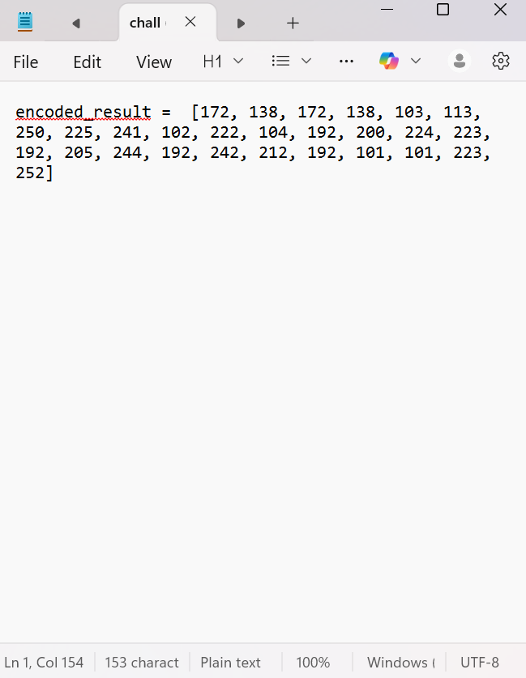
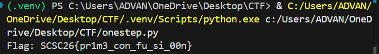

# One Step Ahead

**Kategori**: Crypto  

---
## Deskripsi Challenge

> One Step Ahead

Berkas:
- `chall.txt` – berisi list bilangan `encoded_result`.

Hint:
- “Angkanya kok aneh ya?”
- “Kadang yang penting bukan angkanya sekarang, tapi yang datang setelahnya.”
- “Beberapa angka memang biasa… tapi yang spesial setelahnya sering menentukan hasil.”



---
## Analisis Singkat

Isi `chall.txt`:

```python
encoded_result = [
    172, 138, 172, 138, 103, 113, 250, 225, 241,
    102, 222, 104, 192, 200, 224, 223, 192, 205,
    244, 192, 242, 212, 192, 101, 101, 223, 252
]
````

Hasil Observasi:

- Nilai > 127 → bukan ASCII langsung.
    
- Judul “One Step Ahead” + hint “angka spesial setelahnya” → kuat mengarah ke **next prime**.
    
- Format flag diketahui `SCSC26{...}` → bisa dipakai untuk menguji hipotesis.

Asumsi:

- Untuk setiap karakter dengan kode ASCII `c`, digunakan:
    
    ```text
    enc = c + nextprime(c)
    ```

Uji cepat dengan `'S'` dan `'C'`:

- `'S'` (83) → nextprime(83) = 89 → 83 + 89 = 172 = `encoded_result[0]`
    
- `'C'` (67) → nextprime(67) = 71 → 67 + 71 = 138 = `encoded_result[1]`

Rumus konsisten → lanjutkan dengan brute force di rentang ASCII printable.

---
## Proses Penyelesaian

Untuk setiap `enc` di `encoded_result`:

1. Iterasi `char_code` ∈ [32, 126].
    
2. Hitung `next_prime(char_code)`.
    
3. Jika `char_code + next_prime(char_code) == enc` → temukan karakter asli `chr(char_code)`.
    
4. Gabungkan seluruh karakter menjadi flag.

---
## Script Akhir

```python
#!/usr/bin/env python3
# -*- coding: utf-8 -*-

encoded_result = [
    172, 138, 172, 138, 103, 113, 250, 225, 241,
    102, 222, 104, 192, 200, 224, 223, 192, 205,
    244, 192, 242, 212, 192, 101, 101, 223, 252
]

def is_prime(n: int) -> bool:
    if n < 2:
        return False
    if n in (2, 3):
        return True
    if n % 2 == 0:
        return False
    d = 3
    while d * d <= n:
        if n % d == 0:
            return False
        d += 2
    return True

def next_prime(n: int) -> int:
    x = n + 1
    while not is_prime(x):
        x += 1
    return x

def decode(encoded_list):
    flag_chars = []
    for enc in encoded_list:
        found = False
        for char_code in range(32, 127):  # ASCII printable
            if char_code + next_prime(char_code) == enc:
                flag_chars.append(chr(char_code))
                found = True
                break
        if not found:
            flag_chars.append('?')
    return "".join(flag_chars)

if __name__ == "__main__":
    flag = decode(encoded_result)
    print("Flag:", flag)
```

Output:



---
## Flag

```text
SCSC26{pr1m3_con_fu_si_00n}
```