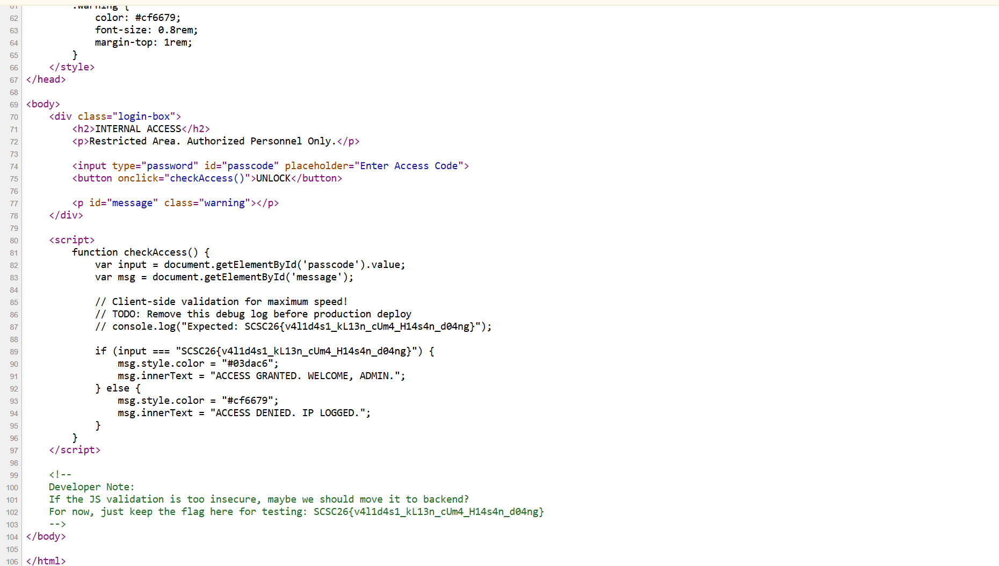

# Internal Access

**Kategori**: Web   
**Flag**: `SCSC26{v4l1d4s1_kL13n_cUm4_H14s4n_d04ng}`

---
## Deskripsi Challenge

> Kami menemukan portal login internal sebuah organisasi rahasia. Mereka mengklaim sistem ini tidak bisa ditembus karena validasi password dilakukan dengan “teknologi klien yang sangat cepat”.
> 
> Benarkah demikian?

Challenge menyediakan halaman login “INTERNAL ACCESS” yang meminta _access code_ untuk membuka akses.

---
## Analisis Singkat

Klaim tersebut tidak valid dari sisi keamanan. Jika validasi password dilakukan di **client-side (JavaScript di browser)**, maka logika pengecekan beserta nilai yang dianggap benar dapat dibaca langsung dari source code yang dikirim ke pengguna. 

---
## Proses Penyelesaian

1. **Akses halaman challenge**
    - Buka: `http://sriwijayasecuritysociety.com:8001/`
        
2. **Lihat source code halaman**
    - Tekan **CTRL + U** (_View Page Source_) atau gunakan menu _View Source_ pada browser.
        
3. **Temukan bagian validasi**
    - Scroll ke bagian `<script>` yang berisi fungsi pengecekan.
    - Di sana terlihat perbandingan input dengan string yang sudah “di-hardcode”, serta komentar developer yang menyimpan flag untuk testing.
        
4. **Ambil flag**
    - Salin nilai flag yang muncul pada source.

---
## Flag

`SCSC26{v4l1d4s1_kL13n_cUm4_H14s4n_d04ng}`