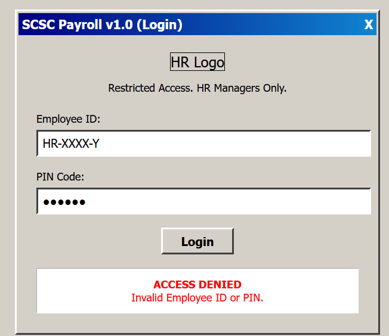
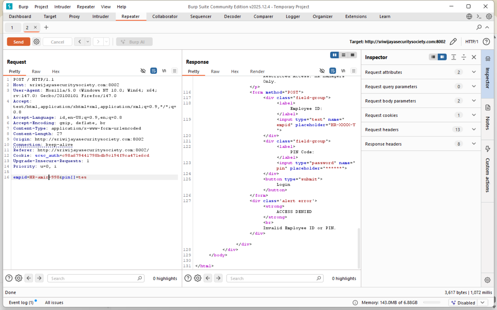
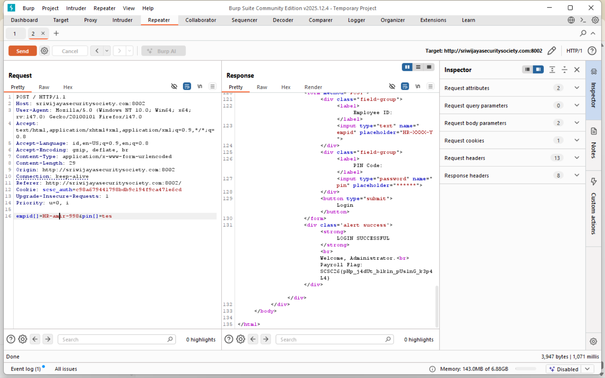

# Legacy HR Payroll

**Kategori**: Web Exploitation  

---
## Deskripsi Challenge

> SCSC Corp masih menggunakan sistem penggajian warisan tahun 90-an. Meskipun kelihatannya kuno (Windows 95 style), manajer HR bersikeras sistem ini aman karena "kode PIN-nya 6 digit acak". Kami menemukan source code lama yang menunjukkan validasi menggunakan fungsi perbandingan string yang tidak aman.

Hint :

- “Validasi menggunakan fungsi perbandingan string yang tidak aman.”
    
- Sistem berjalan di PHP lama (terlihat dari header respons).

---
## Analisis Singkat

Aplikasi hanya menyediakan form login dengan dua parameter:

- `empid` – Employee ID (input text).
    
- `pin` – PIN Code (input password, di UI disebut 6 digit).

Login gagal mengembalikan halaman yang sama dengan pesan:

```html
<div class='alert error'>
  <strong>ACCESS DENIED</strong><br>
  Invalid Employee ID or PIN.
</div>
```

  
Header HTTP menunjukkan backend menggunakan PHP 5.6:

```http
X-Powered-By: PHP/5.6.40
Server: Apache/2.4.25 (Debian)
```

Dengan menggabungkan hint dan versi PHP, hipotesis alami adalah adanya fungsi pembanding string custom yang mencoba membuat “constant-time compare”, tetapi implementasinya salah, misalnya:

```php
function insecure_compare($user, $real) {
    $status = 0;
    for ($i = 0; $i < strlen($user); $i++) {
        $status |= (ord($user[$i]) ^ ord($real[$i]));
    }
    return $status === 0;
}
```

Jika fungsi ini dipanggil seperti:

```php
if (insecure_compare($_POST['empid'], $real_empid) &&
    insecure_compare($_POST['pin'],   $real_pin)) {
    // ACCESS GRANTED
}
```

maka masalah muncul ketika input bukan string. Di PHP 5.x, pemanggilan `strlen()` terhadap array menghasilkan `0` (dengan warning), sehingga loop tidak berjalan dan `$status` tetap `0`. Artinya, jika `$_POST['empid']` dan `$_POST['pin']` dapat dipaksa menjadi array, fungsi `insecure_compare()` akan selalu mengembalikan `true` tanpa perlu mengetahui nilai rahasia sebenarnya.

---
## Proses Penyelesaian

1. **Intercept request login dan identifikasi parameter**  
    Lakukan satu percobaan login dengan nilai acak (misalnya `empid=test`, `pin=123456`) dan intercept request menggunakan Burp Suite. Request yang terlihat pada Repeater berbentuk `POST /` dengan body.
    
      
    Respons selalu mengandung pesan `ACCESS DENIED`, sehingga brute force tidak efisien dan juga dilarang oleh aturan CTF.
    
2. **Menyusun hipotesis fungsi pembanding string yang rentan**  
    Dari hint “fungsi perbandingan string yang tidak aman” dan fakta bahwa backend adalah PHP 5.6, disimpulkan bahwa validasi kemungkinan menggunakan fungsi seperti `insecure_compare($user, $real)` yang mengiterasi sepanjang `strlen($user)` tanpa memeriksa tipe. Dalam PHP, `strlen(array)` akan bernilai `0`, sehingga jika `$user` berupa array, loop tidak berjalan dan fungsi mengembalikan `true`. Jika fungsi ini digunakan untuk `empid` dan `pin`, maka cukup membuat keduanya menjadi array agar validasi otomatis lolos.
    
3. **Uji manipulasi parsial dan verifikasi bahwa kedua parameter divalidasi**  
    Uji awal dilakukan dengan hanya mengubah `pin` menjadi array di Burp Repeater.
	    
    tetapi respons tetap `ACCESS DENIED`. Hal ini mengindikasikan bahwa pengecekan juga dilakukan terhadap `empid` dan kondisi login baru akan terpenuhi jika **kedua** pemanggilan `insecure_compare()` mengembalikan `true`, sehingga kedua parameter harus dikirim sebagai array.
    
4. **Payload final: mengirim `empid` dan `pin` sebagai array**  
    Body request pada Repeater kemudian diubah menjadi:
    
    ```text
    empid[]=x&pin[]=y
    ```
    
    dengan `x` dan `y` bebas (dapat berupa string apa pun, bahkan kosong). Di sisi PHP, ini diparsing sebagai:
    
    ```php
    $_POST['empid'] = array('x');
    $_POST['pin']   = array('y');
    ```
    
    Saat dilewatkan ke fungsi pembanding:
    
    - `strlen($_POST['empid'])` → 0
        
    - `strlen($_POST['pin'])` → 0  
        sehingga loop tidak pernah dieksekusi dan `$status` tetap `0`, mengembalikan `true` untuk kedua perbandingan. Kondisi:
        
    
    ```php
    insecure_compare($_POST['empid'], $real_empid) &&
    insecure_compare($_POST['pin'],   $real_pin)
    ```
    
    menjadi `true && true`, dan aplikasi menampilkan halaman sukses yang memuat flag.



---
## Flag

```text
SCSC26{pHp_j4dUl_bikin_pUsInG_k3p4L4}
```